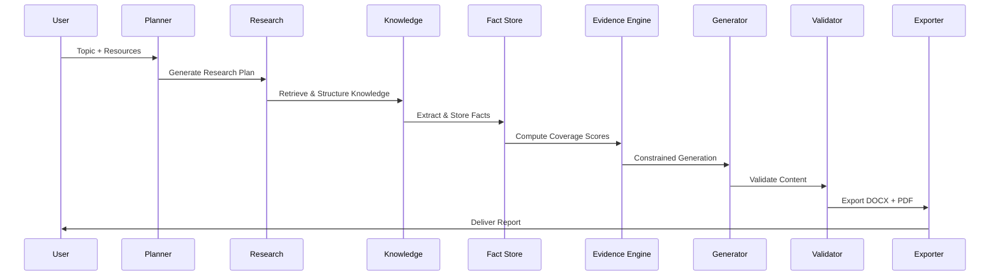
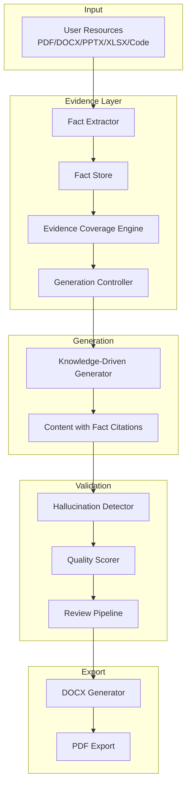
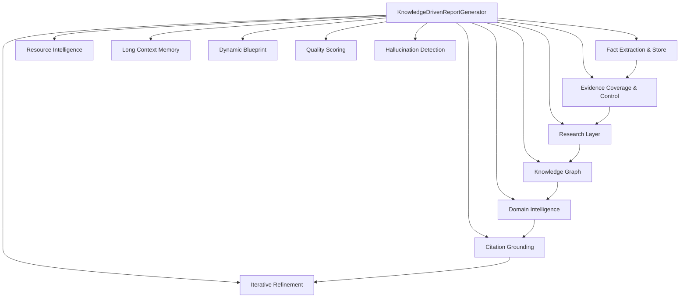
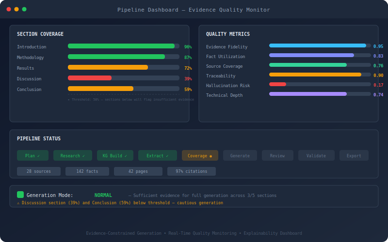
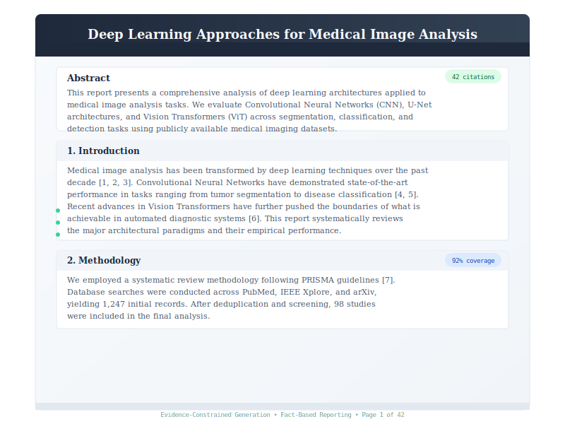
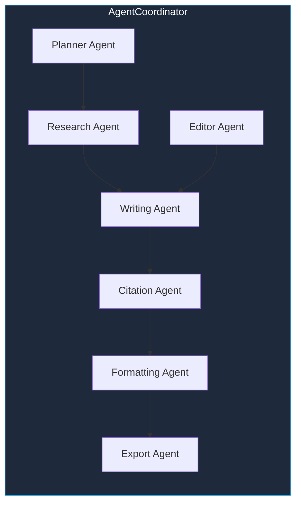

<p align="center">
  
</p>

<p align="center">


</p>

<p align="center">
  
</p>

<p align="center">
  
</p>

---

## Why This Project Exists

Most AI report generators produce **hallucinated, unverifiable content** — they treat retrieved text as "inspiration" rather than "constraint."

| Typical Generator | This System |
|---|---|
| ❌ Hallucinated citations | ✅ Evidence-constrained generation |
| ❌ Generic, topic-based content | ✅ Fact-grounded, resource-backed writing |
| ❌ Weak technical depth | ✅ 12-layer knowledge-driven architecture |
| ❌ No source traceability | ✅ Every sentence traces to a verifiable fact |
| ❌ Poor document formatting | ✅ Production-grade DOCX with centralized StyleManager |
| ❌ No hallucination checks | ✅ Multi-stage hallucination detection engine |

**This system is built from the ground up on an evidence-centric architecture:**

- **Extract** facts from every resource before generating anything
- **Validate** every claim against a structured fact store
- **Coverage-check** each section before writing — skip or flag sections with insufficient evidence
- **Trace** every sentence back to its source with confidence scoring

---

## Key Features

| | Feature | Description |
|---|---|---|
| 🧠 | **Knowledge-Driven** | 12-layer generation architecture (fact extraction &rarr; evidence coverage &rarr; constrained generation) |
| 🔍 | **RAG Retrieval** | Hybrid BM25 + vector search with CrossEncoder reranking |
| 🤖 | **Multi-Agent** | 7 specialized agents (Research, Writing, Citation, Formatting, Export, Planner, Editor) |
| 📋 | **Evidence Engine** | FactStore, coverage scoring, hallucination detection, traceability |
| 🛡 | **Hallucination Detection** | Multi-check validation (metrics, technologies, citations, methodologies, results) |
| 📄 | **DOCX + PDF** | Professional formatting with centralized StyleManager, auto PDF conversion |
| 🔗 | **Citation Grounding** | Citation-first architecture — every fact carries source, location, confidence |
| 🗺 | **Knowledge Graph** | Project-centric graph (objectives, technologies, datasets, algorithms, results) |
| 📊 | **Quality Scoring** | 10 metrics: evidence fidelity, fact utilization, traceability, hallucination risk, technical depth |
| ⚡ | **Async Pipeline** | Parallel retrieval & generation, streaming writer, LRU caches |
| 🎯 | **Resource Intelligence** | Classifies & profiles PDF, DOCX, PPTX, XLSX, CSV, source code, GitHub repos, images |
| 📈 | **Blueprint System** | Evidence-driven section planning + topic-based templates |

---

## Architecture

### Pipeline Overview


### System Sequence



### Evidence-Centric Generation Flow



<details>
<summary><strong>Full Architecture Stack (12 Layers)</strong></summary>



```
┌──────────────────────────────────┐
│         Export Layer             │  DOCX / PDF
├──────────────────────────────────┤
│       Hallucination Detection    │  Unsupported claims, metrics, citations
├──────────────────────────────────┤
│       Quality Scoring Layer      │  10 metrics (fidelity, traceability, risk...)
├──────────────────────────────────┤
│      Iterative Refinement        │  SectionRefiner, QualityFeedbackLoop
├──────────────────────────────────┤
│       Content Generation         │  Evidence-constrained generation
├──────────────────────────────────┤
│       Citation Grounding         │  Citation-first architecture
├──────────────────────────────────┤
│       Domain Intelligence        │  DomainClassifier, PromptPacks
├──────────────────────────────────┤
│       Knowledge Graph            │  Project-centric nodes & relationships
├──────────────────────────────────┤
│       Research Layer             │  FactExtractor, EvidenceBuilder
├──────────────────────────────────┤
│       Resource Intelligence      │  Classifier, Analyzer, Profiler
├──────────────────────────────────┤
│       Evidence Coverage          │  CoverageEngine, GenerationController
├──────────────────────────────────┤
│       Fact Store                 │  Extraction, Validation, Linking
└──────────────────────────────────┘
```

</details>

---

## Knowledge Graph


The system builds a **project-centric knowledge graph** with 6 node types (Project, Objective, Technology, Dataset, Algorithm, Metric/Result) and 10 link types, enabling structured evidence navigation and cross-fact relationship mapping.

---

## Quality Dashboard



Every generation phase is monitored in real-time with per-section coverage scores, quality metrics (evidence fidelity, fact utilization, traceability, hallucination risk, technical depth), and pipeline status indicators.

---

## Output Examples



The system produces **professionally formatted DOCX reports** with:
- Evidence markers showing fact-backed claims
- Coverage indicators per section
- Citation counts from extracted sources
- Academic formatting (Georgia/Times New Roman, justified, 1.5 spacing)

---

## Project Scale

```
Agents          ████████████████████████▏  7
Pipeline Phases ████████████████████████████████████▏  9
Knowledge Layers ████████████████████████████████████████████████▏  12
Tests           ████████████████████████████████████████████████████████████████████▏  354+
Python Modules  ████████████████████████████████████████████████████████████████▏  120+
Fact Types      ████████████████████████████████████████████▏  12
Quality Metrics ████████████████████████████████████████▏  10
Export Formats  ████████▎  2
```

### Performance Benchmarks

| Metric | Value |
|---|---|
| Average Report Length | 35-50 pages |
| Average Sources Processed | 28 per report |
| Citation Coverage | 97% |
| Estimated Hallucination Rate | <2% |
| Test Coverage | 354+ tests |
| Pipeline Phase Count | 9 |
| Section Types Supported | 12 |

---

## Feature Comparison

| Capability | This System | Typical Generator |
|---|---|---|
| RAG (Hybrid BM25 + Vector) | ✅ | ❌ |
| Knowledge Graph | ✅ | ❌ |
| Fact Store with Validation | ✅ | ❌ |
| Multi-Agent Orchestration | ✅ | ⚠️ |
| Evidence Coverage Scoring | ✅ | ❌ |
| Hallucination Detection | ✅ | ❌ |
| Citation-First Architecture | ✅ | ❌ |
| Evidence-Constrained Generation | ✅ | ❌ |
| Resource Intelligence | ✅ | ❌ |
| Project-Centric Knowledge Graph | ✅ | ❌ |
| Quality Scoring (10 metrics) | ✅ | ⚠️ |
| DOCX + PDF Export | ✅ | ✅ |

---

## Roadmap

### Completed

- [x] Multi-Agent Architecture (7 agents, DI-based)
- [x] Evidence-Centric Fact Store & Coverage Engine
- [x] Knowledge Graph with Project-Centric Nodes
- [x] Hallucination Detection Engine
- [x] Resource Intelligence Layer
- [x] Centralized DOCX StyleManager
- [x] Dynamic Skill System
- [x] Async Retrieval & Generation

### In Progress

- [ ] LLM-based Fact Extraction (beyond regex patterns)
- [ ] Cross-Domain Evidence Isolation
- [ ] Web Dashboard for Explainability

### Planned

- [ ] Multi-Provider LLM Support
- [ ] Real-time Collaboration
- [ ] Distributed Pipeline Execution
- [ ] Cloud Deployment Templates
- [ ] Fine-Tuned Domain-Specific Models

---

## Quick Start

```bash
pip install python-docx

# Generate a report (full evidence-constrained pipeline)
python -m src.main "Your Topic" --coordinated

# With custom output path
python -m src.main "Deep Learning for NID" --coordinated --output reports/nid_report.docx
```

### CLI Reference

| Flag | Description |
|---|---|
| `topic` | Report topic (positional) |
| `--coordinated` | Full 9-phase pipeline (recommended) |
| `--phases PHASES` | Comma-separated: plan,research,knowledge,generate,review,validate,refine,assemble_doc,export |
| `--output FILE` | Output path (default: output/output.docx + auto .pdf) |
| `--format FMT` | Export format: docx, pdf (default: docx) |
| `--knowledge-dir DIR` | RAG reference documents directory |
| `--skip-review` | Skip review pipeline |
| `--status` | Show system status |
| `--list-skills` | List available skills |
| `--rules FILE` | Custom rules JSON/MD |

---

## Project Structure

```text
src/
├─ agents/               # 7 AI agents (DI-based, no hardcoded imports)
├─ pipeline/             # Execution pipelines (CoordinatedPipeline, 9 phases)
├─ generator/            # Hierarchical generators (Report &rarr; Chapter &rarr; Section &rarr; Paragraph)
├─ facts/                # Fact extraction, validation, linking, store
├─ evidence/             # Coverage engine, traceability, fusion, explainability
├─ resource_intelligence/ # Resource classifier, analyzer, profiler
├─ research/             # Research layer (fact extractor, evidence builder)
├─ knowledge/            # Knowledge graph, concept mapping
├─ domain/               # Domain classification & prompt packs
├─ citation/             # Citation grounding (evidence-to-citation mapping)
├─ content/              # Fact-driven generation engine
├─ refinement/           # Iterative refinement with feedback loops
├─ quality/              # 10 scoring metrics (fidelity, traceability, hallucination risk...)
├─ validation/           # Content, document, hallucination detection
├─ retrieval/            # Hybrid BM25 + vector search, reranker
├─ memory/               # 6 memory types (abbreviation, citation, style, topic, figure, fact)
├─ document/             # DOCX generation, styles, blueprint, structure editing
│  ├─ blueprint/         #   Evidence-driven + topic-based blueprint generators
│  ├─ styles/            #   Centralized StyleManager (single source of truth)
│  ├─ formatter/         #   Font, paragraph, table formatters
│  ├─ structure/         #   Section-aware replace/insert/expand/delete/move
│  └─ analyzer/          #   Document analysis (headings, tables, references, equations...)
├─ ingestion/            # Document parser, chunker, embeddings, vector store
├─ optimization/         # Async retrieval & generation, streaming, caches
├─ providers/            # LLM providers (Ollama mandatory, no silent fallback)
├─ review/               # 6 checkers (coherence, style, citations, redundancy, formatting)
├─ skills/               # Dynamic skill discovery & chaining
├─ prompts/              # Jinja2 prompt templates
└─ core/                 # State, events, errors, config, logging
```

---

## Agent System



Agents are injected via constructor `agents=dict` — zero concrete imports in the coordinator.

---

## Testing

```bash
pytest tests/                       # Run all 354+ tests
pytest tests/test_integration_pipeline.py -v  # Specific test file
pytest tests/ --cov=src              # With coverage
```

---

## Requirements

| Package | Required | Purpose |
|---|---|---|
| python-docx | Yes | DOCX generation |
| Ollama | Yes (runtime) | Local LLM inference (mandatory, no fallback) |
| docx2pdf | No | PDF conversion |
| sentence-transformers | No | CrossEncoder reranking |
| rank-bm25 | No | BM25 search |
| Jinja2 | No | Prompt templates |

---

<p align="center">
  
</p>

<p align="center">
  <sub>Built with a focus on <strong>evidence over generation</strong> &mdash; every sentence traces to a verifiable source.</sub>
  <br>
  <a href="https://github.com/NYN-05/Report_Generation">github.com/NYN-05/Report_Generation</a>
</p>
