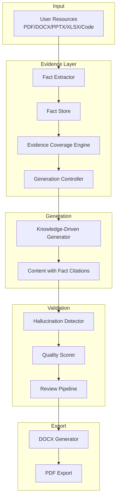
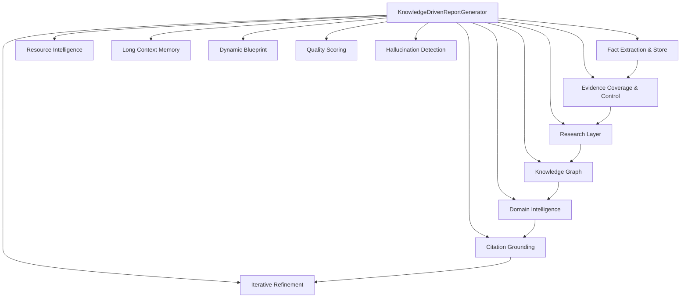
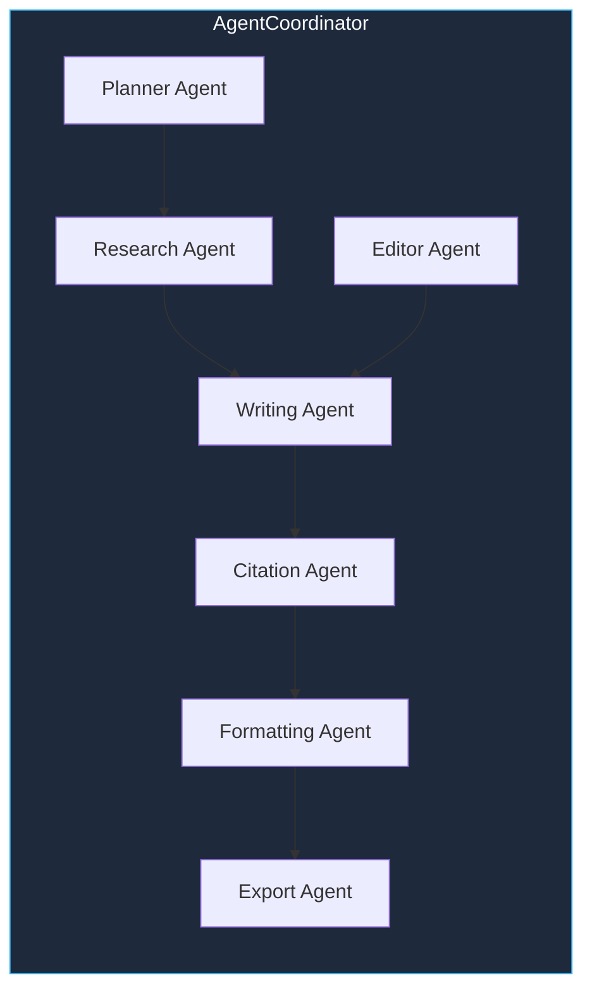

<p align="center">
  
</p>

<p align="center">


</p>

---

## Why This Project?

Most report generators produce **hallucinated, unverifiable content**. They treat retrieved text as "inspiration" rather than "constraint." This system is built from the ground up on an **evidence-centric architecture**:

- **Extract** facts from every resource before generating anything
- **Validate** every claim against a structured fact store
- **Coverage-check** each section before writing — skip or flag sections with insufficient evidence
- **Trace** every sentence back to its source with confidence scoring

The result: reports that are **factually grounded, citation-traceable, and academically credible**.

---

## Key Features

| | Feature | Description |
|---|---|---|
| 🧠 | **Knowledge-Driven** | 12-layer generation architecture (fact extraction → evidence coverage → constrained generation) |
| 🔍 | **RAG Retrieval** | Hybrid BM25 + vector search with CrossEncoder reranking |
| 🤖 | **Multi-Agent** | 7 specialized agents (Research, Writing, Citation, Formatting, Export, Planner, Editor) |
| 📋 | **Evidence Engine** | FactStore, coverage scoring, hallucination detection, traceability |
| 🛡 | **Hallucination Detection** | Multi-check validation (metrics, technologies, citations, methodologies, results) |
| 📄 | **DOCX + PDF** | Professional formatting with centralized StyleManager, auto PDF conversion |
| 🔗 | **Citation Grounding** | Citation-first architecture — every fact carries source, location, confidence |
| 🗺 | **Knowledge Graph** | Project-centric graph (objectives, technologies, datasets, algorithms, results) |
| 📊 | **Quality Scoring** | 10 metrics: evidence fidelity, fact utilization, traceability, hallucination risk, technical depth |
| ⚡ | **Async Pipeline** | Parallel retrieval & generation, streaming writer, LRU caches |
| 🎯 | **Resource Intelligence** | Classifies & profiles PDF, DOCX, PPTX, XLSX, CSV, source code, GitHub repos, images |
| 📈 | **Blueprint System** | Evidence-driven section planning + topic-based templates |

---

## Architecture

### Pipeline Overview


### Evidence-Centric Generation Flow



### Knowledge-Driven Generator (12 Layers)



---

## Project Scale

| Metric | Value |
|---|---|
| 📁 Python Modules | 120+ |
| 🧪 Tests | 354+ |
| 🤖 Agents | 7 |
| 🧠 Knowledge Layers | 12 |
| 📦 Export Formats | 2 (DOCX + PDF) |
| 📚 Fact Types | 12 |
| 🔗 Link Types | 10 |
| ⚡ Pipeline Phases | 9 |
| 🛡 Quality Metrics | 10 |

---

## Feature Comparison

| Capability | This System | Typical Generator |
|---|---|---|
| RAG (Hybrid BM25 + Vector) | ✅ | ❌ |
| Knowledge Graph | ✅ | ❌ |
| Fact Store with Validation | ✅ | ❌ |
| Multi-Agent Orchestration | ✅ | ⚠️ |
| Evidence Coverage Scoring | ✅ | ❌ |
| Hallucination Detection | ✅ | ❌ |
| Citation-First Architecture | ✅ | ❌ |
| Evidence-Constrained Generation | ✅ | ❌ |
| Resource Intelligence | ✅ | ❌ |
| Project-Centric Knowledge Graph | ✅ | ❌ |
| Quality Scoring (10 metrics) | ✅ | ⚠️ |
| DOCX + PDF Export | ✅ | ✅ |

---

## Quick Start

```bash
# Install
pip install python-docx

# Generate a report (knowledge-driven pipeline)
python -m src.main "Your Topic" --coordinated

# With custom output
python -m src.main "Machine Learning for NID" --coordinated --output reports/nid_report.docx
```

### Generate with Evidence Mode

```bash
# Full pipeline with evidence-constrained generation
python -m src.main "AI Ethics" --coordinated --phases plan,research,generate,review,validate,refine,assemble_doc,export

# Skip review for faster iteration
python -m src.main "Deep Learning" --coordinated --skip-review
```

---

## CLI Reference

| Flag | Description |
|---|---|
| `topic` | Report topic (positional) |
| `--coordinated` | Use CoordinatedPipeline (9 phases) |
| `--phases PHASES` | Comma-separated: plan,research,knowledge,generate,review,validate,refine,assemble_doc,export |
| `--output FILE` | Output path (default: output/output.docx + auto .pdf) |
| `--format FMT` | Export format: docx, pdf (default: docx) |
| `--knowledge-dir DIR` | RAG reference documents directory |
| `--skip-review` | Skip review pipeline |
| `--status` | Show system status |
| `--list-skills` | List available skills |
| `--rules FILE` | Custom rules JSON/MD |

---

## Project Structure

```text
src/
├─ agents/               # 7 AI agents (DI-based, no hardcoded imports)
├─ pipeline/             # Execution pipelines (CoordinatedPipeline, 9 phases)
├─ generator/            # Hierarchical generators (Report → Chapter → Section → Paragraph)
├─ facts/                # 🧠 Fact extraction, validation, linking, store
├─ evidence/             # 📋 Coverage engine, traceability, fusion, explainability
├─ resource_intelligence/ # 🔍 Resource classifier, analyzer, profiler
├─ research/             # 📚 Research layer (fact extractor, evidence builder)
├─ knowledge/            # 🗺 Knowledge graph, concept mapping
├─ domain/               # 🏷 Domain classification & prompt packs
├─ citation/             # 🔗 Citation grounding (evidence-to-citation mapping)
├─ content/              # ✍️ Fact-driven generation engine
├─ refinement/           # 🔄 Iterative refinement with feedback loops
├─ quality/              # 📊 10 scoring metrics (fidelity, traceability, hallucination risk...)
├─ validation/           # 🛡 Content, document, hallucination detection
├─ retrieval/            # 🔎 Hybrid BM25 + vector search, reranker
├─ memory/               # 💾 6 memory types (abbreviation, citation, style, topic, figure, fact)
├─ document/             # 📄 DOCX generation, styles, blueprint, structure editing
│  ├─ blueprint/         #   Evidence-driven + topic-based blueprint generators
│  ├─ styles/            #   Centralized StyleManager (single source of truth)
│  ├─ formatter/         #   Font, paragraph, table formatters
│  ├─ structure/         #   Section-aware replace/insert/expand/delete/move
│  └─ analyzer/          #   Document analysis (headings, tables, references, equations...)
├─ ingestion/            # 📥 Document parser, chunker, embeddings, vector store
├─ optimization/         # ⚡ Async retrieval & generation, streaming, caches
├─ providers/            # 🔌 LLM providers (Ollama mandatory, no silent fallback)
├─ review/               # ✅ 6 checkers (coherence, style, citations, redundancy, formatting)
├─ skills/               # 🎯 Dynamic skill discovery & chaining
├─ prompts/              # 📝 Jinja2 prompt templates
└─ core/                 # ⚙ State, events, errors, config, logging
```

---

## Agent System



Agents are injected via constructor `agents=dict` — zero concrete imports in the coordinator.

---

## Testing

```bash
# Run all 354+ tests
pytest tests/

# Specific test file
pytest tests/test_integration_pipeline.py -v

# With coverage
pytest tests/ --cov=src
```

---

## Requirements

| Package | Required | Purpose |
|---|---|---|
| python-docx | Yes | DOCX generation |
| Ollama | Yes (runtime) | Local LLM inference (mandatory, no fallback) |
| docx2pdf | No | PDF conversion |
| sentence-transformers | No | CrossEncoder reranking |
| rank-bm25 | No | BM25 search |
| Jinja2 | No | Prompt templates |

---

## License

MIT

---

<p align="center">
  <sub>Built with a focus on <strong>evidence over generation</strong> — every claim traces to a verifiable source.</sub>
</p>

<p align="center">
  <a href="https://github.com/NYN-05/Report_Generation">GitHub</a>
</p>
