<p align="center">
  
</p>

<p align="center">
  <a href="#"></a>
  <a href="#"></a>
  <a href="#"></a>
  <a href="#"></a>
  <a href="#"></a>
</p>

---

Most AI report generators hallucinate — they treat your documents as inspiration, not constraint. This project flips that: **extract facts first, generate second.**

| Typical AI Generator | This System |
|---|---|
| Writes first, cites later | Extracts facts before writing a word |
| Hallucinates metrics & citations | Validates every claim against a fact store |
| Requires expensive cloud APIs | Runs on **local Ollama** — zero API cost |
| Black-box generation | Transparent regex + LLM pipeline |

---

<p align="center">
  
</p>

---

| Area | What It Does |
|---|---|
| **Fact Extraction** | Regex discovery of metrics, algorithms, datasets, results — 13 fact types |
| **Hybrid RAG** | BM25 + vector search (ChromaDB) with CrossEncoder reranking |
| **Knowledge Clustering** | LLM-powered grouping of facts into coherent concept clusters |
| **Hallucination Detection** | Multi-pattern validation flags unsupported claims before export |
| **Quality Scoring** | Evidence fidelity, traceability, and hallucination risk scoring |
| **DOCX Export** | Cover page, TOC, evidence appendix, centralized style management |
| **Web Enrichment** | Optional DuckDuckGo / Tavily to fill evidence gaps automatically |

---

## Quick Start

```bash
pip install -r requirements.txt
ollama serve
python -m src.main "Deep Learning for Intrusion Detection" --knowledge-dir knowledge/
```

| Flag | What It Does |
|---|---|
| `topic` | Report topic (required) |
| `--knowledge-dir` | Reference documents directory |
| `--output FILE` | Output path (default: `output/output.docx`) |
| `--min-coverage N` | Evidence coverage threshold (default: 0.3) |
| `--web-search` | Enable fact enrichment via web search |
| `--tavly` | Use Tavily API (requires `TAVILY_API_KEY`) |

---

## Project Structure

```
src/
├─ main.py                  # Pipeline orchestration
├─ facts/                   # Fact extraction, validation, store
├─ evidence/                # Web search enrichment
├─ generator/               # Ollama synthesis, blueprint, planning
├─ analysis/                # Knowledge clustering & coverage audit
├─ validation/              # Hallucination detection engine
├─ quality/                 # Pre/post generation quality metrics
├─ document/                # DOCX generation with style management
├─ ingestion/               # Parsing, chunking, embedding
├─ retrieval/               # BM25 + vector search + reranker
├─ providers/               # Ollama provider with retry & circuit breaker
├─ collection/              # Wikipedia knowledge collection
└─ core/                    # Config, logging, state, utils
```

---

## Dependencies

| Required | Optional |
|---|---|
| Ollama (runtime), python-docx, chromadb | sentence-transformers, rank-bm25, duckduckgo_search, docx2pdf, Jinja2 |

---

## Roadmap

**Done:** Fact extraction, fact store, hybrid RAG, knowledge clustering, hallucination detection, quality scoring, DOCX export

**Next:** LLM-powered fact extraction, multi-agent orchestration, knowledge graph, dashboard, parallel execution

---

```bash
pytest tests/
```

---

<p align="center">
  <b>Evidence over generation.</b> Every sentence traces to a verifiable source.
  <br>
  <a href="https://github.com/NYN-05/Report_Generation">github.com/NYN-05/Report_Generation</a>
</p>
